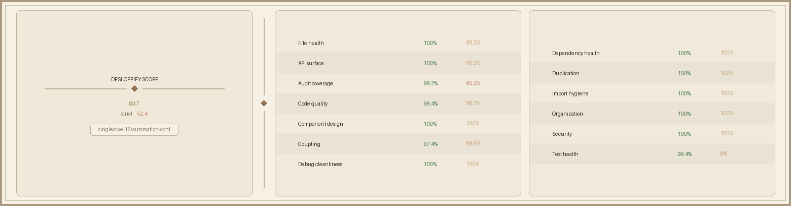

# Automation Config Hub

A modern configuration management dashboard for automation workflows. Built as an internal tool PoC for managing, editing, and monitoring automation configs across environments.



## Features

- **Dashboard** — At-a-glance stats with animated counters, type breakdown, and recent activity feed
- **Automations Grid** — Sortable, filterable ag-Grid table with inline editing, quick search, and per-row delete
- **Config Detail View** — Full config editor with accordion sections, key-value entry management, and metadata cards
- **CRUD Operations** — Create, edit, and delete automations with toast notifications and confirmation dialogs
- **Dark/Light Mode** — System-aware theme toggle with smooth transitions
- **Responsive Layout** — Collapsible sidebar drawer on mobile, full sidebar on desktop
- **Polished UX** — Framer Motion staggered animations, spring dialogs, animated progress bars, hover reveals

## Tech Stack

| Layer | Tech |
|---|---|
| Framework | React 19 + TypeScript 5.9 |
| Build | Vite 7 |
| Styling | Tailwind CSS 4 + shadcn/ui (Radix primitives) |
| State | Zustand |
| Data Grid | ag-Grid Community |
| Animations | Framer Motion |
| Routing | React Router 7 |
| Icons | Lucide React |

## Getting Started

```bash
npm install
npm run dev
```

Open [http://localhost:5173](http://localhost:5173) in your browser.

## Scripts

| Command | Description |
|---|---|
| `npm run dev` | Start dev server with HMR |
| `npm run build` | Type-check and build for production |
| `npm run preview` | Preview production build locally |
| `npm run lint` | Run ESLint |

## Project Structure

```
src/
├── components/
│   ├── automations/     # Grid, add dialog, status badge
│   ├── config-detail/   # Detail page helper cards
│   ├── config-editor/   # Section/entry accordion editor
│   ├── dashboard/       # Stat cards, type breakdown, activity
│   ├── layout/          # Root layout, sidebar, header
│   └── ui/              # shadcn/ui primitives
├── data/                # Mock seed data
├── lib/                 # Utilities and hooks
├── pages/               # Route pages
├── stores/              # Zustand store
└── types/               # TypeScript types
```

## Current Scope

This is a **proof-of-concept** with mock data and client-side state. There is no backend, authentication, or persistent storage — all data lives in Zustand and resets on refresh.
